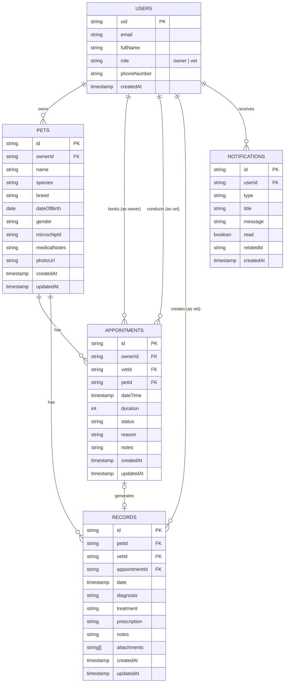
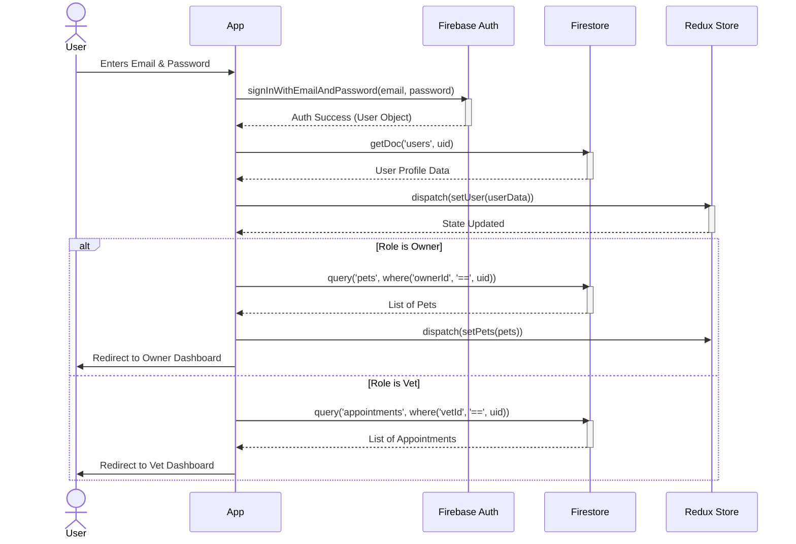
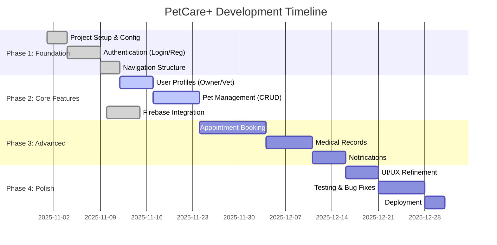
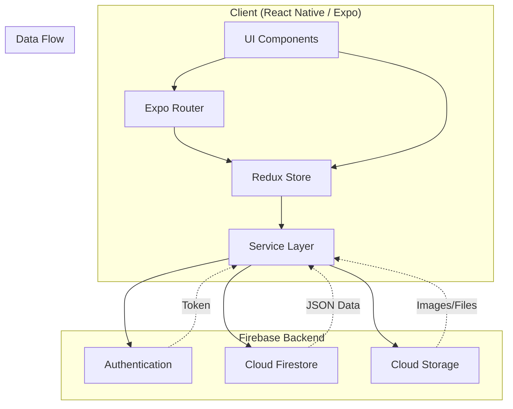
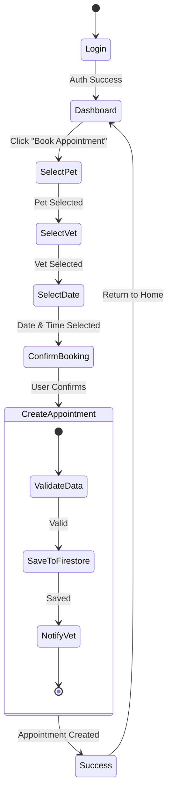

# Diagrams

## Entity Relationship Diagram (ERD)



## Sequence Diagram: User Login & Data Fetching



## Gantt Chart: Development Plan



## Architecture Diagram



## Activity Diagram: Appointment Booking Process



## Use Case Diagram

```mermaid
usecaseDiagram
    actor "Pet Owner" as Owner
    actor "Veterinarian" as Vet
    package "PetCare+ System" {
        usecase "Login / Register" as UC1
        usecase "Manage Profile" as UC2
        usecase "Manage Pets" as UC3
        usecase "Book Appointment" as UC4
        usecase "View Medical Records" as UC5
        usecase "Manage Medical Records" as UC6
        usecase "View Appointments" as UC7
        usecase "Receive Notifications" as UC8
    }

    Owner --> UC1
    Owner --> UC2
    Owner --> UC3
    Owner --> UC4
    Owner --> UC5
    Owner --> UC8

    Vet --> UC1
    Vet --> UC2
    Vet --> UC6
    Vet --> UC7
    Vet --> UC5
```


